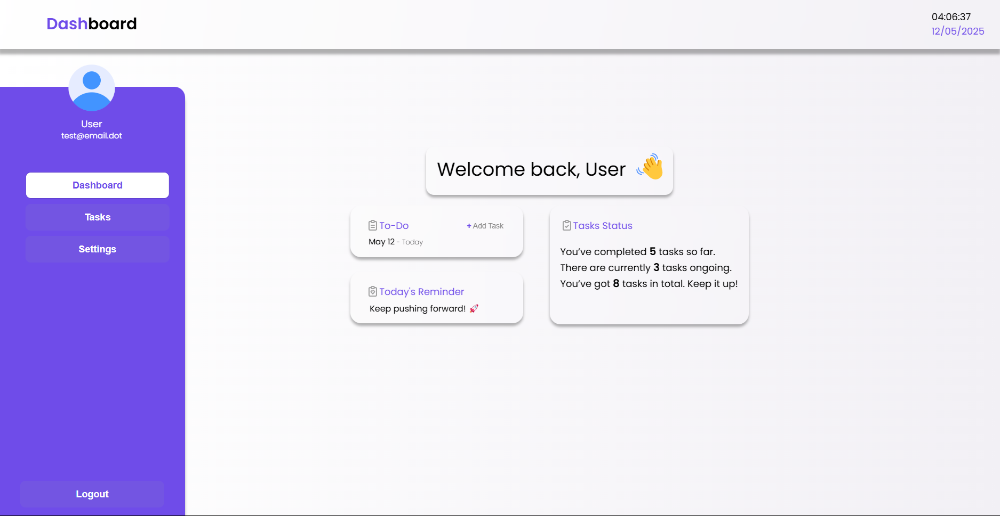

# 🗂️ Task Manager API

**Task Manager API** is a full-stack task management web application built with **Node.js**, **Express**, **React**, and **MongoDB**. It includes secure user authentication, a password reset system via email, and a dynamic user dashboard for managing tasks and profile settings.

---

## 📸 Preview

---

## 🚀 Features

- 🔐 **Secure Authentication**: JWT-based login system with bcrypt password hashing.
- 📩 **Forgot Password**: Automatically sends a password reset email.
- ✅ **Task Management**: Create, update, complete, and delete tasks (CRUD).
- ⚙️ **User Settings**: Change name, email, and password through the dashboard.

---

## 🛠️ Tech Stack

| Layer        | Tech                        |
|--------------|-----------------------------|
| **Frontend** | React.js, Axios             |
| **Backend**  | Node.js, Express            |
| **Database** | MongoDB (via Mongoose)      |
| **Auth**     | JWT, Bcrypt                 |
| **Email**    | ???  |
=======
# 🗂️ Task Manager API

**Task Manager API** is a full-stack task management web application built with **Node.js**, **Express**, **React**, and **MongoDB**. It includes secure user authentication, a password reset system via email, and a dynamic user dashboard for managing tasks and profile settings.

---

## 📸 Preview

---

## 🚀 Features

- 🔐 **Secure Authentication**: JWT-based login system with bcrypt password hashing.
- ✅ **Task Management**: Create, complete, and delete tasks.
- ⚙️ **User Settings**: Change name and email through the dashboard.

---

## 🛠️ Tech Stack

| Layer        | Tech                        |
|--------------|-----------------------------|
| **Frontend** | React.js, Axios             |
| **Backend**  | Node.js, Express            |
| **Database** | MongoDB (via Mongoose)      |
| **Auth**     | JWT, Bcrypt                 |
